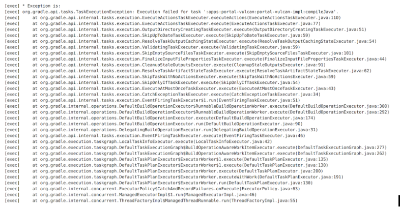
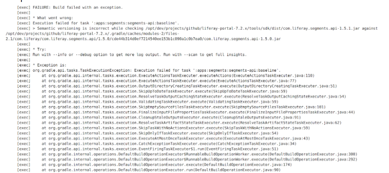
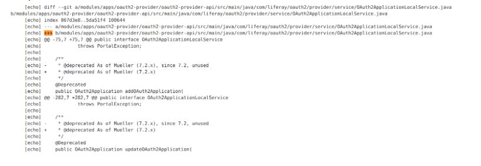
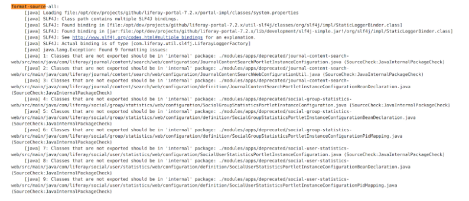
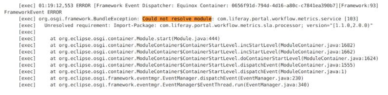

Different Failures and How To Analyze Them
===========================================

The following is a list of different types of failures and examples of each.

Compile Failure
----------------
  Scroll to the bottom, then start scrolling up to find the stacktrace. Identify the failing task, then search for when it first fails in the console logs. From there, see why it failed. Keep in mind that the failure may look different from the one in the example. 

  **Example:**
  |image0|

  The failing task is: :apps:portal-vulcan:portal-vulcan-impl:compileJava

Functional Test Failure
-----------------------
  `See this video recording`_.

Semantic Versioning
-------------------
  There are a couple of ways to find semantic versioning issues. The first would to search for “version increase”. Sometimes that won’t work so you’ll need to find the stacktrace, see what task failed, then find where the task first failed.

  **Example 1:**
  |image1|

  **Example 2:**
  |image2|
  The failing task is: :apps:segments:segments-api:baseline

  |image3|

Service Builder
---------------
  Search for “+++”
  **Example:**
  |image4|

Source Format
-------------
  Search for “format-source”. The failures are listed after the line:
  ``java.lang.Exception: Found X formatting issues:``

  **Example:**
  |image5|

  In this example, there are nine total formatting issues. 

Startup
--------
  Start from the bottom and scroll up until you see a stacktrace. A common failure is a dependency issue, so I usually start by searching for “could not resolve module”

  **Example:**
  |image6|

.. |image1| image:: ./img/semantic-versioning-1.PNG

.. |image3| image:: ./img/semantic-versioning-3.PNG

.. _See this video recording: https://drive.google.com/file/d/0BySFfOWPyNghWkRzRzNSdEt5ZFE/view
