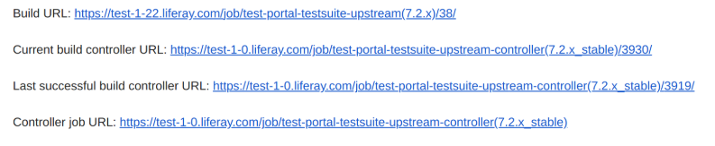

Analyzing Stable Job failures
=============================

Discover a Stable Job Failure
------------------------------

|image0|

  * *Build URL*: link to the Jenkins Report of the failed run
  * *Current build controller URL* - use this link to find the commit of the current run
  * *Last successful build controller URL* - use this to find the commit of the last good run
  * *Controller job URL* - use this to see all of the stable job runs for that branch

Notify #portal-failures and #portal-ee-failures
-------------------

  #. On the `#portal-failures channel`_ and/or `#portal-ee-failures channel`_, let others know there is a stable job failure and what branch it’s on.
  #. Add a magnifying glass reaction (:mag:) to your comment to indicate the issue is being investigated.
  #. Add a snippet of the failure as a reply to your comment.   
  #. Once the stable job is passing again, remove the magnifying glass reaction ``:mag:`` and add a heavy checkmark reaction ``:heavy_check_mark:`` to indicate the issue has been resolved.

.. Document the Failure
.. --------------------
.. #. Create a LRQA ticket to document the failure - Example 1, Example 2
.. Issue Type: Task
.. Summary: ${Branch} Stable Failure - ${Failure Type}
.. Affects Version: ${Branch}
.. Component: Portal
.. Label: qa-s
.. Description: Stacktrace, Causing commit (if known)
.. Failure Types (not a comprehensive list):
.. Compile - portal fails to compile
.. Functional - functional batch fails
.. Integration - integration test fails
.. PortalLogAssertorTest - PortalLogAssertorTest fails
.. PortalSmoke - PortalSmoke batch fails
.. Startup - portal fails to startup
.. Unit - unit test fails
.. Once the failure is resolved, assign it to yourself and close the ticket. Here is some useful information to add to your ticket in a comment:
.. What commit the Stable Job starts passing on
.. What commit or revert resolved the issue

Jenkins Report
--------------

|image1|

  #. If there aren’t any downstream builds, it generally means that portal failed to compile. Another possible reason is a poshi validation error. Click on Console to view the console logs.
  #. If there is a downstream job, view the Result.
    * Failure: portal failed to startup. View the console logs of the axis.
    * Unstable: PortalSmoke ran but it failed. Check the poshi report. To view it, click on the link to functional smoke batch, default, then Poshi Report.

Analysis
--------

  See documentation on `How to Analyze Failures`_

Commit Range
------------

  To compare a range of commits:
  ``https://github.com/brianchandotcom/liferay-portal/compare/successfulCommit...failedCommit``

  .. note::
    Remember to use liferay-portal-ee for 7.2.x since it’s in the private repository.

  Comparing the two will give you a range of possible commits where the failure was introduced.

  In order to narrow down what commit caused the error, consider the following options:

    * Compare what is failing with possible developers within that component. For example, if there is a startup error due to an unresolved blogs module, look for commits from Adolfo or other people on the Collaboration team. Compare the files changed in their commits with the stacktrace. This is a general rule of thumb, as there could be failures due to bad backports or BChan adding additional commits under the same LPS ticket.
    * Another option is to see what file is causing the failure and if anyone made recent commits to that file. Take those commits and see if they fall within your comparison range.
    * Another option would be to take the ticket number and search for corresponding pull requests in BChan’s closed queue. From there, look at the ci:test:relevant results to see if the same error is seen. Keep in mind, this doesn’t always work and should generally be used to verify a suspected commit. 

Contact 
--------

  Contact the developer or test lead for that component, or mention Brian Chan on the thread.

  .. Keep in mind that sometimes he’ll just fix it on his own so check his origin first to see if he fixed the issue. Another option would be to fetch his branch from Github and try to reproduce the issue locally. He generally goes home between 4 PM to 4:30 PM, so if you miss him during work hours, he’ll address the failure later in the evening. He usually gets back on around 7 PM or 8 PM.

  If you know which commit/pull resolves the issue, add that as a reply to your original comment in Slack.

.. |image1| image:: ./img/stable-02.PNG

.. _`#portal-failures channel`: https://liferay.slack.com/archives/CLCD3DQLF
.. _`#portal-ee-failures channel`: https://liferay.slack.com/archives/CLCD3DQLF
.. _`How to Analyze Failures`: https://docs.google.com/document/d/11Xc6bTGHOMKw7hzLb9I7ZUdZplDhYZP516XECIO5WpI/edit
