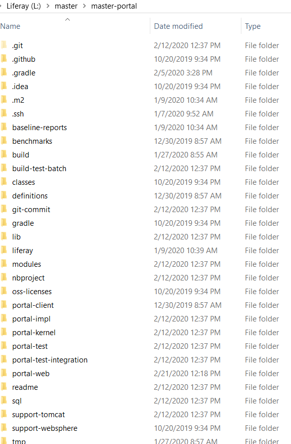

As mentioned in a previous section, source code is unusable in its raw, uncompiled form.  It is human language not understandable by a machine. This raw form is how we make changes to the code and is therefore always being worked on. To work on code, we would need a copy of ‘source’ in our local machines. Before we pull source, navigate to `Liferay Portal on Github`_ and fork the liferay-portal repo. Once you’ve forked liferay-portal, use the following steps to pull the main, master branch locally.

.. note::
  Follow these instructions to `generate an SSH Key`_ if you are asked to generate one or if you run into permission issues when fetching master.

Fetch Master
^^^^^^^^^^^^^

1. Create a folder, ``master`` (for more information, see the section on Organizing Source Code).
2. Inside the ``master`` folder, create a folder name ``master-portal``.
3. Inside ``master-portal``, Initialize git (run ``git init``).
4. In the created git folder, edit the ``.git/config`` file to the following
:
::
  [core]
  	repositoryformatversion = 0
  	filemode = false
  	bare = false
  	logallrefupdates = true
  	ignorecase = true
  	autocrlf = input
  [remote "origin"]
    fetch = +refs/heads/*:refs/remotes/origin/*
    url = git@github.com:{yourusername}/liferay-portal.git
  [remote "upstream"]
  	fetch = +refs/heads/*:refs/remotes/upstream/*
  	url = git@github.com:liferay/liferay-portal.git
  [github]
  	user = {yourusername}

.. note::
  * It's not actually necessary to define your personal (local on your machine) remote "origin" or the Liferay remote "upstream". It is merely a defining convention we've stuck to in QA for simplicity. As such, from this point on, we'll be referring to the **personal remote as "origin"** and the **Liferay remote as "upstream"**.

.. note::
  * Remember to include your username in the origin URL - the only difference between the origin and upstream URLs is that origin URL uses your username (since it's your origin)

After this, you can now run the following commands to pull code to your [branch]]-portal folder. In the case below, we're pulling the master branch into the master-portal folder, then checking out to that branch forcefully (-f).

``git fetch upstream master`` and when that's done, ``git checkout -f master``.

In the end, your folder should look something like this:

|image0|

.. note::
  Run ``git config --system core.longpaths true`` in your master-portal root directory if you run into a ``Filename too long`` error.

.. _Liferay Portal on Github: http://github.com/liferay/liferay-portal
.. _generate an SSH Key: https://help.github.com/en/github/authenticating-to-github/connecting-to-github-with-ssh
