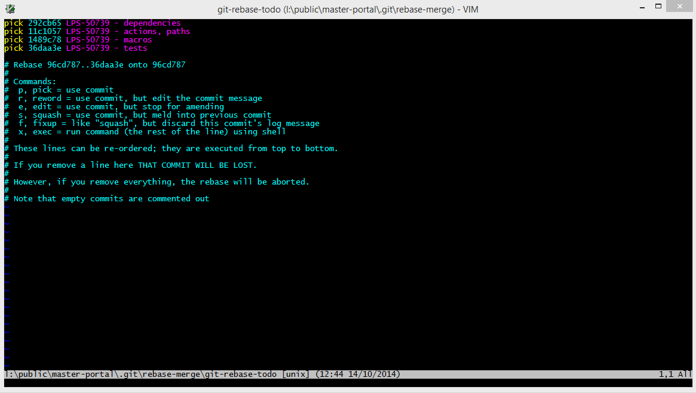
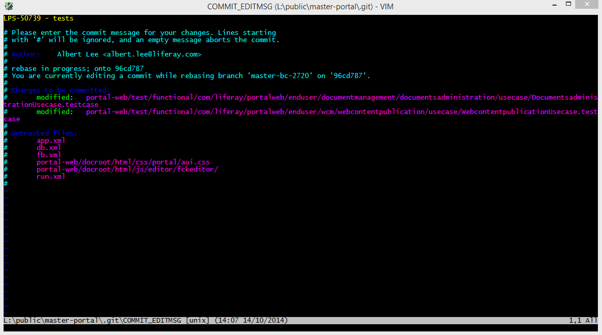

===================
Reviewer Guidelines
===================

This article gives general guidelines for reviewers.

General Guidelines
------------------

Always do the following before you pass on the commits to the next reviewer:

1. rebase the branch
2. ant format-source (from /portal-impl or /portal-web)
3. ant -f build-test.xml run-poshi-validation

Whether to do a source formatting commit or to push work back to the test writer is ultimately your call to make. However, these are the general rules that we follow:

1. When to use source formatting commit
  * minor logic or formatting change
  * changes caught by ant format-source
2. When to push back to test writer
  * build-selenium error
  * rebase error
  * major logic or formatting change

When reviewing, try to follow these rules:

1. Trust that what people submit is working. Don't bother checking paths or macros or tests to make sure that they pass. Test writers are supposed to have attached a report.html file to their ticket. If you do not see this, you can just ask for them to attach it.
2. Check to make sure that the writer followed the commit standards (and committed under the correct LPS ticket if applicable).
3. Check for formatting and in general look to make sure there isn't anything crazy (extra line breaks, bad indents, etc).
4. Look over the macros and variables that get passed in and check to see if macros are written in a way that is modular and reusable.
5. If the writer implemented something in a way you don't agree with, talk it over with the writer and find out where he/she is coming from. Try your best to reach a consensus. You'll have the final say, but always try to reach something that you can both agree on.
6. If you are unsure about something, it never hurts to ask another reviewer for another opinion.

When you are done reviewing and send a pull request to pass on the work to the next reviewer, please comment on the LRQA ticket that you have pushed the changes to the next reviewer and put the URL(s) of the pull request(s).

Example:
::
  Pushed to BChan.
  https://github.com/brianchandotcom/liferay-portal-ee/pull/2715

Fetching Other Branches
-----------------------

In order to review someone else's work and then pass it along to the next reviewer, you will have to fetch their branch. To fetch other branches, use the following git command. This command creates a copy of their branch in your local repository with a name that you designate.

  ``git fetch [Repository URL] [Their branch name]:[Your branch name]``

* **Repository URL:** This is the url of the repository you are fetching from. Usually it will look something like this:

  ``https://github.com/${theirGithubUserName}/liferay-portal-ee.git``

* **Their branch name:** This is the name of their branch that they submitted. If they followed the pull request wiki, then this will be the same as the pull request title.
* **Your branch name:** ​Designate a name for this branch using the standards below.

Branch Name Standards
---------------------

An older QA branch naming standard is to name the branches master-qa-ticketNumber or 7.2.x-qa-ticketNumber, example, ``master-qa-LRQA-12345``. This has since been changed to match how the rest of Engineering names their branches using only the ticket number, example, ``LRQA-12345 | master``.

Both are acceptable since the branch name does not affect the commits. For best practice, coordinate with your reviewer or product team on whether they have a specific convention for branch naming.  

Commit Standards
------------------

If you need to make changes, follow the `Commit Standards Wiki <16-automation-test-commit-standards>`_.

Github Comment Standards
------------------------

These should all be separate comments. This is the minimum amount of formatting comments necessary to ensure that the test fixing/writing process can be tracked. Additional information helpful to reviewers can still be added if a reviewer finds it necessary, but must still include these comments.

**Failed test review:**
::
  Pushed tests back to [First Initial][Last Name].
  [Describe changes to be made here]

**Source formatting needed:**
::
  SF for [First Initial][Last Name].
  [Describe changes that were made]

**No source formatting needed:**
::
  No test changes needed :)

**"Pushed to" comment:**
::
  Pushed to [First Initial][Last Name].
  https://github.com/[username]/liferay-portal-ee/pull/[###]

Using "git rebase - i"
----------------------

When you need to edit multiple commit messages or amend a particular commit, you can use "git rebase" to do this. Use the following:
  ``git rebase - i HEAD~#``
  
Replace the # symbol with the number of commits you want to go back. It's good to overshoot by at least 1 commit just to be safe. For example, if you want to edit something that is 3 commits previous, you should use "git rebase -i HEAD~4".

This will then take you to a rebase-merge file that lists the number of commits that you designated starting from the most recent commit in reverse chronological order. The screen will take you to also show you a list of available commands.

You will have to edit the text that displays. In windows this is done using the VIM editor. (To edit, press "i" and then make your edits. When you are done and want to save, press ``esc`` and then type ``:wq`` and then press "enter". The ``wq`` stands for write/quit.)

To edit a commit message, change the "pick" to "reword" and write/quit.

Afterwards you will be directed to a screen to edit the commit message. Edit the commit message and write/quit.

Note that if you're in the middle of a cherry-pick or rebase, git commit will not automatically continue the cherry-pick or rebase for you, and you will have to use "git cherry-pick --continue" or "git rebase --continue".

Using git rebase -i to Edit a commit message, Edit a commit, or Delete a commit
~~~~~~~~~~~~~~~~~~~~~~~~~~~~~~~~~~~~~~~~~~~~~~~~~~~~~~~~~~~~~~~~~~~~~~~~~~~~~~~

If you run into rebase issues, many times you can use "git rebase --abort", that will stop the process. Then you can try again.

Starting git rebase -i
~~~~~~~~~~~~~~~~~~~~~~

1. Navigate to the branch you want to work on in terminal. For example cd /private/liferay-portal-master
2. Enter "git rebase -i HEAD#". Replace "#" with the number of commits you want to display and potentially edit.
3. Notice the commits will display with the word "pick" next to them. At this screen you will be able to do everything.

Editing a commit message
~~~~~~~~~~~~~~~~~~~~~~~~

1. Go to the commit line that you want to edit and replace the word "pick" with "reword" (you can do this for as many commits as you like)
2. Press Control + x to initiate the action
  1. It will ask you "Save modified buffer (ANSWERING "No" WILL DESTROY CHANGES) ?" - Enter "y" for yes
  2. Then it will say "File Name to Write:$git-rebase-todo" - Press Enter to continue
3. Change the commit message however you need to
  1. Control + x to continue
  2. "Y" to save the changes
  3. Press Enter to finish

Editing a Commit
~~~~~~~~~~~~~~~~

1. Go to the commit line that you want to edit and replace the word "pick" with "edit" (I would recommend doing 1 file at a time to prevent confusion/conflicts)
2. Press Control + x to initiate the action
  1. It will ask you "Save modified buffer (ANSWERING "No" WILL DESTROY CHANGES) ?" - Enter "y" for yes
  2. Then it will say "File Name to Write:$git-rebase-todo" - Press Enter to continue
3. Make any changes necessary to any file
4. When you are done, STAGE each of those changes using: git add $(file name)
5. In terminal on the branch enter "git commit --amend", Control + x to continue
6. Then in terminal on the branch enter "git rebase --continue"
7. Your changes to that commit should be applied

Deleting a commit
~~~~~~~~~~~~~~~~~

1. Go to the commit line that you want to delete and erase the whole line (from "pick" to the end of the commit message, erase the whole commit)
2. Press Control + x to initiate the action
  1. It will ask you "Save modified buffer (ANSWERING "No" WILL DESTROY CHANGES) ?" - Enter "y" for yes
  2. Then it will say "File Name to Write:$git-rebase-todo" - Press Enter to continue
3. As long as there are no conflicts, the commit should be deleted

Modifying the Author of a Commit
--------------------------------
If you need to split commits apart but don't want the original writer to lose credit for his or her work, you can amend a commit's author.

To change the author of a commit, change the "pick" to "edit" and use the following:
::
  git commit --amend --author="[New Author Name] <email@address.com>"