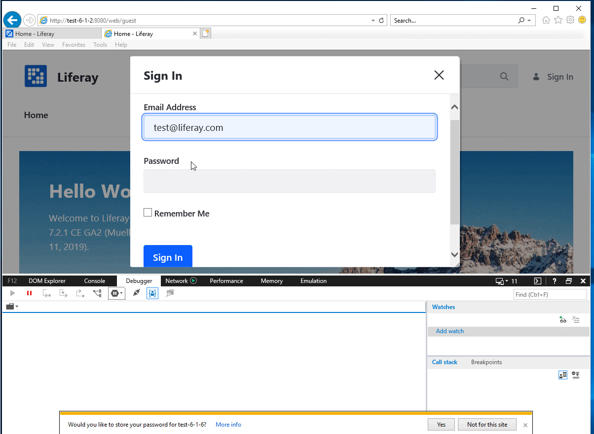
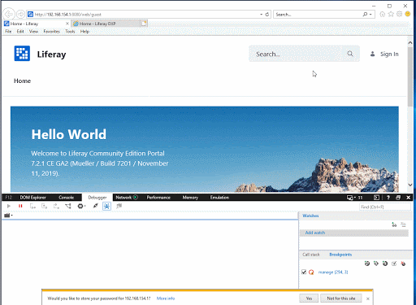
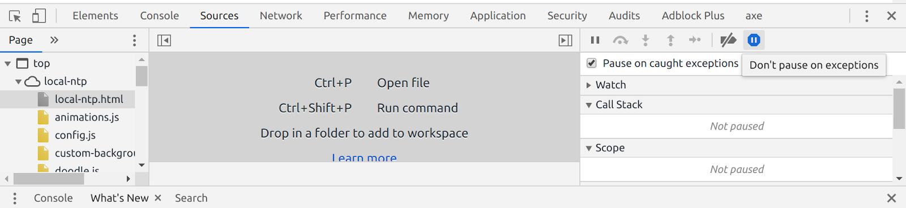
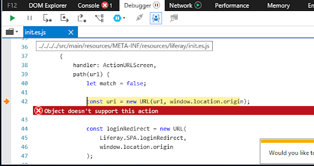
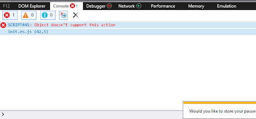

========================================================
General Frontend QA Regression Testing and Reporting SOP
========================================================

Purpose
-------

This document aims to give guidance on how to provide useful debug information in a frontend related bug/regression ticket for a frontend developer to efficiently fix the issue.

What to do if there’s a frontend bug
------------------------------------

If you find a UI/Javascript/frontend related error, please take a minute and open up the browser DevTools while running portal and reproduce the issue while monitoring the Devtool’s console tab. Copy a trace of the error as part of the JIRA ticket. You may also need to enable “pause on exceptions” and/or disable javascript fast loading (no combo, no minifer) to provide useful trace of the js error. A step by step guide is provided in the next sections.

Browser DevTools console messages
^^^^^^^^^^^^^^^^^^^^^^^^^^^^^^^^^

Based on discussion in `COMMERCE-2592`_.

  * **Message in INFO or WARNING level**: If there’s no functional/UI issue associated with the warning/info message, this is not considered a bug.
  * **Message in LOG level**: file as BUG FP1 or FP2 , the QA needs to provide the step by step, and the frontend of the component team will clean this log
  * **Message in ERROR level**: file as BUG FP3, FP4 or FP5 , the QA needs to provide the step by step, and the frontend of the component team will work to fix this bug
  
Escalation Path - Which dev can look into this?
^^^^^^^^^^^^^^^^^^^^^^^^^^^^^^^^^^^^^^^^^^^^^^^

**Not all frontend issues belong to Frontend Infrastructure**. As a rule of thumb, issues should be filed first in the component where the issue is found, **unless** it is clear this issue occurs across multiple components. For example, if the bug only exists in Blogs application component, use Blogs as the component label. If there’s a bug with CKEditor within Blogs and the bug is reproducible on web content and multiple other components that use CKEditor, then it’s most likely a CKEditor bug. An example of identifying which team owns a failing js-unit test is detailed here. Team Leads and Product Engineers, or experienced QA Testers, should be able to better assess if the issue belongs to Infra or not. 

**If component team wants to raise issue up to FI to look into they can**. However, **FI team generally prefers that the team who owns the affected component takes a look first and raises it to FI team if need help**. And would hopefully share some context since they're the most familiar with that component.

If it is **not an urgent issue** (does not need to be fixed asap) and it’s determined assistance from Frontend Infra is needed after the Product Team has reviewed, then you can **assign it to a component that is owned by Frontend Infrastructure team** (`components`_). The bug will be displayed in our `Bugs Dashboard`_ and will be looked at based on priority and current work.

If the issue is a `Fix Pack/Release blocker related`_ or an **urgent issue** and you would like to escalate to FI team, you can get more immediate feedback in slack channel  `#t-frontend-infra`_. You can also **mention or assign** in the JIRA Ticket: **@Product Team Frontend Infrastructure** or use the product's team email account: *pt-frontend-infrastructure@liferay.com*. Either way you will notify the team including the Subject Matter Expert (SME), and the team will decide who is the best person to help you.

.. note::
  
    If feasible, please conduct a `Root Cause Analysis (RCA)`_. This will greatly reduce the turn around time of resolving the issue.

Usecase: Sign In Bug
--------------------
The following usecase will use `LPS-99661`_ as an example for a typical frontend issue debug.

What if I get combo (#,###) output?
^^^^^^^^^^^^^^^^^^^^^^^^^^^^^^^^^^^

Sometimes, the trace in the DOM may show “combo(#,####)” instead of a specific file (ie: init.es.js) because minifiers and caching are applied throughout portal. Combo won’t provide any useful information. 

Combo output: Not useful ✖



Javascript.fast.load Disabled: Correct useful output ✔



Pause on exceptions
^^^^^^^^^^^^^^^^^^^

IE11 “pause on exceptions” shown in Debugger tab shown in gifs above.

  * Click through the Green triangle “play button” to continue to last exception

Chrome “pause on exceptions” found in Sources tab in screenshot below:



How to disable javascript fast loading
--------------------------------------

For the DOM trace to display the specific file you’ll need to disable javascript fast loading. As described in `portal.liferay.com docs`_, one quick way to disable minifiers is to append the following parameter to the URL line: ```&js_fast_load=0```  or ```&js_fast_load=0&css_fast_load=0&strip=0``` (https://liferay.dev/blogs/-/blogs/turn-off-minifiers-and-html-stripping)

Sometimes this is not possible, in the case of LPS-99661 since the error occurs on home page, adding &js_fast_load=0 doesn’t work.

Another way is to set  javascript.fast.load=false and minifier.enabled=false in portal-ext.properties. This usually avoids “combo” (combination of files run at same time) and instead the DevTools will display the specific file that’s breaking as the possible cause.

You may also need to enable “pause on exceptions” in the debugger if there are multiple exceptions thrown or if the scripts executes too fast.

Some other properties to help debug are disabling caching and minification in your portal-ext.properties:

.. code::

  #Disable caching
  com.liferay.portal.servlet.filters.alloy.CSSFilter=false
  com.liferay.portal.servlet.filters.cache.CacheFilter=false
  com.liferay.portal.servlet.filters.etag.ETagFilter=false
  com.liferay.portal.servlet.filters.header.HeaderFilter=false
  combo.check.timestamp=true
  javascript.fast.load=false
  layout.template.cache.enabled=false
  theme.css.fast.load.check.request.parameter=true
  theme.css.fast.load=false
  theme.images.fast.load.check.request.parameter=true
  theme.images.fast.load=false

  #Disable minification
  javascript.log.enabled=false
  minifier.enabled=false

More details can be found in the `liferay-frontend-guidelines repository`_.

Debugger output when clicking on sign in portlet with ```javascript.fast.load=false```
^^^^^^^^^^^^^^^^^^^^^^^^^^^^^^^^^^^^^^^^^^^^^^^^^^^^^^^^^^^^^^^^^^^^^^^^^^^^^^^^^^^^^^

Include a screenshot of this the line break.


    
    
Browser console output
^^^^^^^^^^^^^^^^^^^^^^

Copy a trace of the error as part of the JIRA ticket.



.. code:: 
  
  Object doesn’t support this action
  init.es.js (42,5)

Including this trace info would provide valuable info in identifying and fixing issues for frontend developers and will make it easier to distinguish similar issues from one another.

Other frontend debug reporting examples
---------------------------------------

* `LPS-99390`_ 
* `LPS-96010`_ 
* `LPS-123457`_

Experimentation
----------------

.. tip::

  There's a setting to print out more information to the browser when the javascript component doesn't load (i.e. when you get an infinite loading spinner)
  
  System Settings > Infrastructure > JavaScript Loader > :white_check_mark: Explain Module Resolutions

.. links:
.. _COMMERCE-2592: https://issues.liferay.com/browse/COMMERCE-2592?focusedCommentId=2075364&page=com.atlassian.jira.plugin.system.issuetabpanels:comment-tabpanel#comment-2075364
.. _components: https://airtable.com/shrLbM2FWHPWUlTsx/tbl66zH9L32CxqoNu
.. _Bugs Dashboard: https://issues.liferay.com/secure/Dashboard.jspa?selectPageId=26482
.. _Fix Pack/Release blocker related: https://docs.google.com/document/d/18vHDwRpF18ZYaHmUJuDE6C8sJTNEmkCIQ8GH0aSI2VA/edit#heading=h.wp86feu5ylvs
.. _#t-frontend-infra: https://join.slack.com/share/zt-et8cn23k-S6ZYVzotCxZu~Yl6LscNDw
.. _Root Cause Analysis (RCA): /../tools/rca-tool.rst
.. _LPS-99661: https://issues.liferay.com/browse/LPS-99661
.. _portal.liferay.com docs: https://portal.liferay.dev/docs/7-2/frameworks/-/knowledge_base/f/using-developer-mode-with-themes#javascript-fast-loading
.. _liferay-frontend-guidelines repository: https://github.com/liferay/liferay-frontend-guidelines/blob/master/dxp/environment.md
.. _LPS-99390: https://issues.liferay.com/browse/LPS-99390?focusedCommentId=1922130&page=com.atlassian.jira.plugin.system.issuetabpanels%3Acomment-tabpanel#comment-1922130
.. _LPS-96010: https://issues.liferay.com/browse/LPS-96010
.. _LPS-123457: https://issues.liferay.com/browse/LPS-124357?focusedCommentId=2331911&page=com.atlassian.jira.plugin.system.issuetabpanels:comment-tabpanel#comment-2331911


