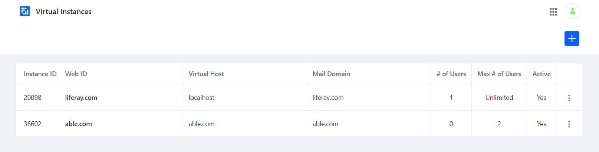

==================================
Setup a Virtual Instance on Portal
==================================

Below are the steps in setting up a Virtual Instance on Portal.

As an example, we will use able.com as our virtual URL.

1. Configure your hosts file to include ``able.com``. 

  .. note::
    `How to Edit Your Hosts File on Windows, Mac or Linux`_
    
2. On Portal, navigate to the Virtual Instances administration page.

3. Fill in the required fields, see the image below for an example.

4. On a web browser, navigate to ``able.com:8080`` to access the virtual instance.

.. _How to Edit Your Hosts File on Windows, Mac or Linux: https://www.howtogeek.com/howto/27350/beginner-geek-how-to-edit-your-hosts-file/
