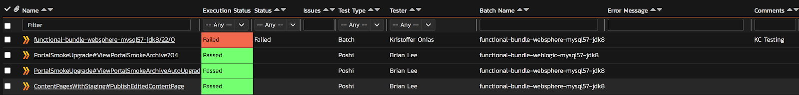

===================================
Quick Start Guide to Spira Analysis
===================================

Setup Spira for Analysis
------------------------

Add some or all of the following columns to recreate a similar experience to that of Testray. Be sure to rearrange and resize the columns so that they fit your workflow.

+-----------------------------------------------------+----------------------------------------------------------------------+
| **Function**                                        | **Column Name**                                                      |
+-----------------------------------------------------+----------------------------------------------------------------------+
| Filter by test environment                          | * Option 1: Application Server, Database, Java JDK, Operating System |
|                                                     |                                                                      | 
|                                                     | * Option 2:  Batch Name                                              |
+-----------------------------------------------------+----------------------------------------------------------------------+
| Filter by team                                      | Main Component                                                       |
+-----------------------------------------------------+----------------------------------------------------------------------+
| Filter by test type                                 | Test Type                                                            |
+-----------------------------------------------------+----------------------------------------------------------------------+
| View and edit comments                              | Comments                                                             |
+-----------------------------------------------------+----------------------------------------------------------------------+
| View error messages                                 | Error Message                                                        |
+-----------------------------------------------------+----------------------------------------------------------------------+
| Indicating the analysis result for a test           | Status (not to be confused with Execution Status)                    |
+-----------------------------------------------------+----------------------------------------------------------------------+
| Indicate ticket(s) associated with the test failure | Issues                                                               |
+-----------------------------------------------------+----------------------------------------------------------------------+

Here's an example:

Recreating the Testray Workflow in Spira
----------------------------------------

1. Indicate that you are analyzing a particular test by setting the Tester field to your name.
  To bulk edit multiple rows:
  * Double click rows to be edited OR check rows then right click > Edit items
  * Click “fill with this value” button

  .. image:: ./img/quick-start-to-analysis-2.png

2. To view any build artifacts, click on the Jenkins Build link and then click the appropriate build artifact from Jenkins.

  .. image:: ./img/quick-start-to-analysis-3.png

  .. image:: ./img/quick-start-to-analysis-4.png

  Optionally, leave a comment about the test failure.
  
3. Once you’ve finished analysis for a test, add the JIRA ticket(s) to the Issues field - not the URL.

.. important::
  Every failure needs to have an issue. This is how we’ll figure out if we’ve finished analysis.

